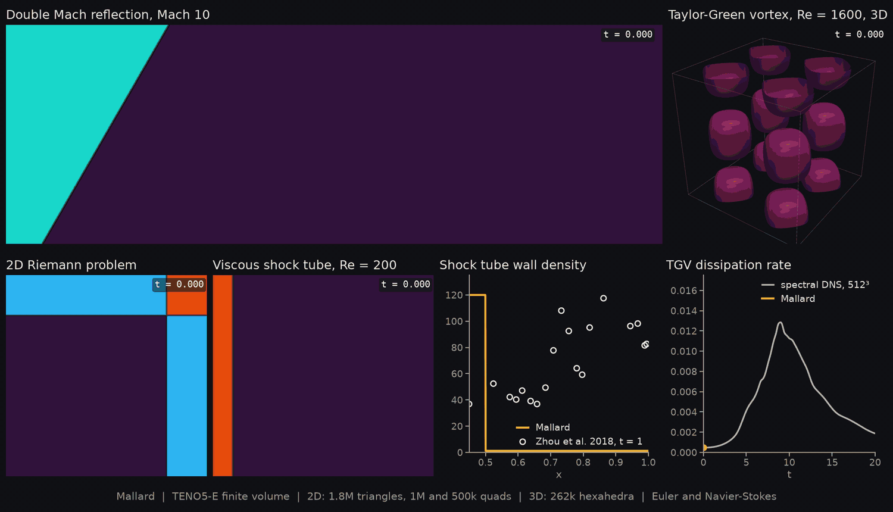

[](https://www.gnu.org/licenses/agpl-3.0)


Mallard is a high-order unstructured finite volume solver for the compressible Euler and Navier-Stokes equations, written in C++ with [Kokkos](https://github.com/kokkos/kokkos) for performance portability.



*Double Mach reflection, a 2D Riemann problem and the Daru & Tenaud viscous shock tube ([`examples/`](examples)), with the shock tube's wall density at t = 1 landing on the grid-converged reference of [Zhou et al.](https://arxiv.org/abs/1705.09062).*

> **NOTE:** Mallard is a **work in progress**: 2D only for now (3D and MPI are next), and GPU performance has only begun to be tuned.

## Features

- Compressible Euler and Navier-Stokes equations (calorically perfect gas, constant or Sutherland viscosity)
- Unstructured meshes of triangles, quadrilaterals or both, read from Gmsh files or generated
- Face reconstruction:
  - First order
  - Second-order MUSCL with least-squares gradients and Barth-Jespersen or Venkatakrishnan limiting
  - TENO-E of orders 3 to 6 ([Liang, Shyy & Fu, J. Sci. Comput. 2025](https://doi.org/10.1007/s10915-025-02918-w)): k-exact least squares on a large central stencil and three or four sector stencils, a density-based troubled-cell indicator, characteristic-wise stencil selection with an adaptive cutoff, and mirror ghost cells at boundaries
- Riemann solvers: Rusanov, HLL, HLLC, Roe, and the carbuncle-free rotated-hybrid HLL-Roe
- Source terms: gravity and arbitrary expressions
- Time integration: forward Euler, SSPRK3, RK4, with the time step set by a CFL number
- Boundary conditions: transmissive, symmetry, adiabatic, isothermal and heat-flux walls (optionally moving), inflow with fixed velocity, pressure and temperature, pressure outlet, and time-dependent states given as expressions; zones can be split between conditions
- Initial conditions given as analytical expressions, integrated over each cell
- Restart files
- Output to VTU (ParaView), with `.pvd` time series
- Simple TOML input files

## Building

Mallard depends on [Kokkos](https://github.com/kokkos/kokkos) (5.x), [toml11](https://github.com/ToruNiina/toml11) and [exprtk](https://github.com/ArashPartow/exprtk), all included in this repository; Kokkos and toml11 are submodules.

```sh
git clone --recursive https://github.com/MatthewBonanni/mallard.git
cd mallard
cmake -S . -B build -DCMAKE_BUILD_TYPE=Release -DUSE_SYSTEM_KOKKOS=OFF -DKokkos_ENABLE_THREADS=ON
cmake --build build -j
```

Pick the Kokkos backend at configure time, for example `-DKokkos_ENABLE_OPENMP=ON`, or `-DKokkos_ENABLE_CUDA=ON -DKokkos_ARCH_AMPERE80=ON -DCMAKE_CXX_COMPILER=$PWD/src/external/kokkos/bin/nvcc_wrapper` for NVIDIA A100 GPUs (add `-DKokkos_ENABLE_OPENMP=ON` too, so host-side setup such as TENO's precomputation runs in parallel). To use an installed Kokkos instead, pass `-DUSE_SYSTEM_KOKKOS=ON -DKokkos_DIR=/path/to/kokkos`.

| CMake option | Default | Description |
|---|---|---|
| `USE_SYSTEM_KOKKOS` | `ON` | Use an installed Kokkos instead of the submodule |
| `Mallard_USE_DOUBLE` | `ON` | Double precision (single precision otherwise) |
| `Mallard_ENABLE_MPI` | `OFF` | Distributed memory with MPI: `mpirun -n N Mallard -i input.toml` splits the mesh between ranks (solution output and restart from several ranks are not supported yet) |
| `Mallard_GPU_AWARE_MPI` | `OFF` | With MPI on GPUs: hand device buffers to a CUDA-aware MPI instead of staging halos through host memory |
| `Mallard_ENABLE_HDF5` | `OFF` | Find or build HDF5 (not used by the solver yet) |
| `BUILD_DOCS` | `OFF` | Doxygen documentation target |

## Running

```sh
cd examples/riemann_2d
../../build/src/Mallard -i input.toml --kokkos-num-threads=8
```

See [`examples/`](examples) for complete input files and [`docs/input.md`](docs/input.md) for every input option.

## Testing

```sh
./build/test/MallardTest
```

The test suite checks mesh geometry, the Riemann solvers against an exact Riemann solver, time integrator convergence orders, gradient and limiter properties, TENO design order on triangles and quadrilaterals, free-stream preservation, discrete conservation, symmetry preservation, shock tubes against exact solutions, viscous flows against exact solutions (Couette, Stokes' first problem, conduction), and bit-for-bit restarts.

## Postprocessing

`tools/` contains Python scripts (numpy, matplotlib, scipy, imageio) for reading Mallard's VTU files, plotting profiles against exact solutions, and rendering animations:

```sh
python tools/animate.py examples/riemann_2d/solut riemann
```

## Contributing

Mallard uses the [Google C++ Style Guide](https://google.github.io/styleguide/cppguide.html).

## License

Mallard is licensed under the AGPL v3.0 License. See the [LICENSE](LICENSE) file for more details.
